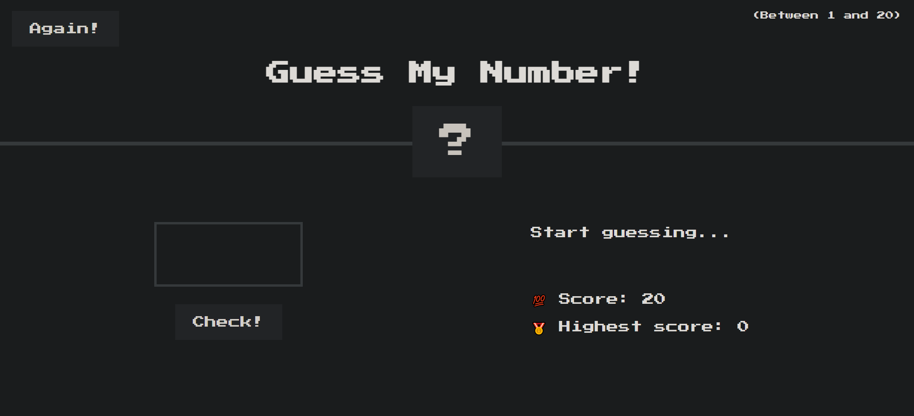

# Guess the Number Website

This retro-style browser game challenges players to guess a number between 1 and 20. The simple yet engaging interface provides a fun and addictive experience, perfect for casual gaming.

[Take a live look at my website powered by ](link)



## Features

- Retro design
- Simple and fun
- A good tool for time passing

## Usage

### Prerequisites:

Clone the repository (GitBash):

- Insert this command in your GitBash:

```bash
git clone https://github.com/edg96/GuessTheNumber
```

## A long advice

This project offers a straightforward opportunity to focus on the core building blocks of web development: HTML, CSS, and JavaScript.

- HTML serves as the foundation of web pages, defining the structure and content of a website. A solid understanding of HTML enables the creation of custom layouts, the integration of multimedia elements, and the effective organization of content

- CSS handles the styling of web pages, allowing control over the appearance of elements, such as colors, fonts, spacing, and layout. Mastery of CSS results in visually appealing and responsive designs

- JavaScript introduces interactivity and dynamic behavior to web pages. It is used to create animations, manage user interactions, and build complex web applications

This project is designed to test knowledge of HTML, CSS, and JavaScript.
